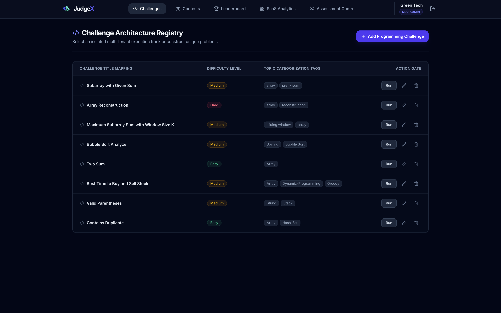
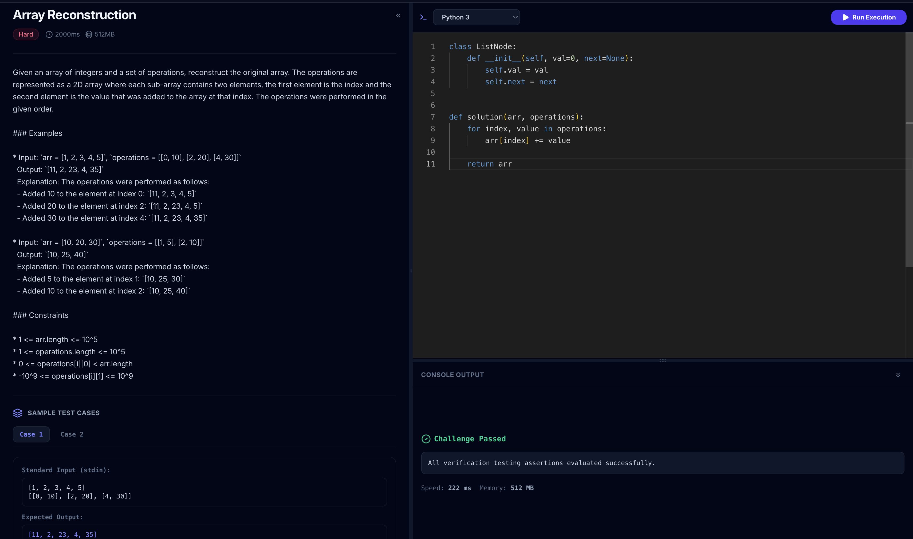
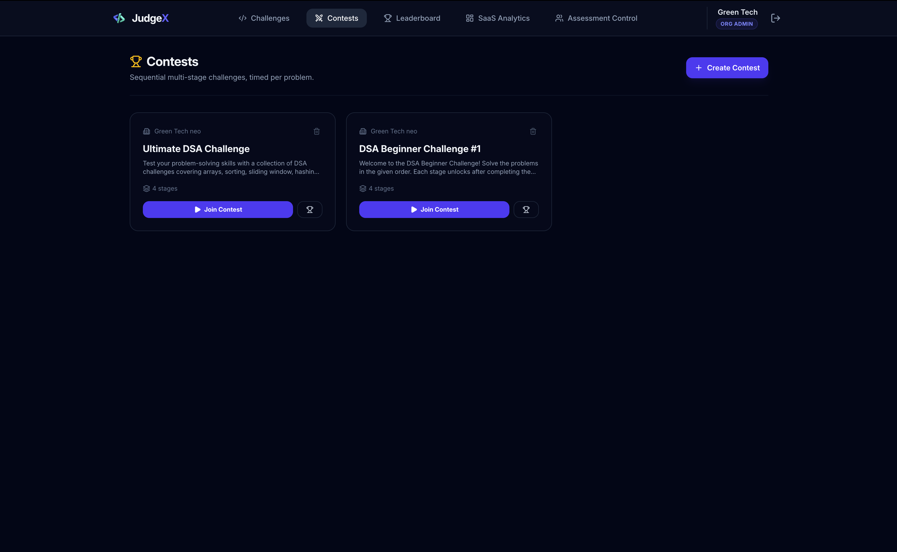
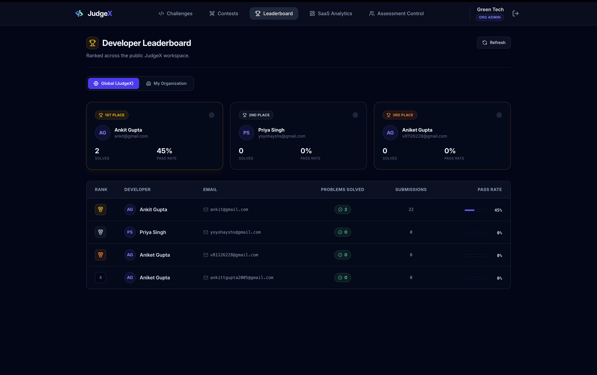
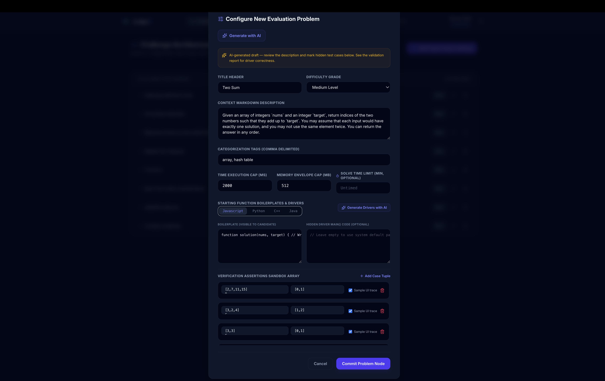
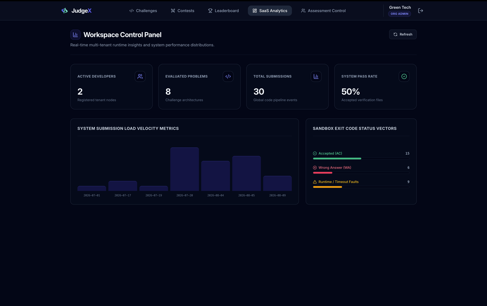

# JudgeX AI

<p align="center">
  
</p>

<h3 align="center">AI-Powered Multi-Tenant Coding Assessment & Contest Platform</h3>

<p align="center">
  Create coding problems • Run contests • Execute code securely • Evaluate submissions in real time
</p>

---

## 📌 About JudgeX AI

**JudgeX AI** is a full-stack coding assessment and contest platform built for organizations, colleges, recruiters, and development teams.

It provides a complete workflow for creating programming problems, conducting timed assessments, executing candidate code, evaluating submissions, and monitoring results.

The platform combines a traditional web application with a distributed code-execution architecture:

- React-based coding interface
- Express REST API
- MongoDB Atlas for persistent data
- Redis + BullMQ for asynchronous execution jobs
- Dedicated worker process
- Ephemeral Docker containers for code execution
- Redis Pub/Sub for result events
- Socket.IO for real-time frontend updates
- JWT authentication and role-based authorization
- Email OTP verification
- AI-assisted problem and driver generation using Groq

---

# 🚀 Core Features

### 👥 Multi-Tenant Organizations
- Organization/workspace-based architecture
- Server-side organization isolation
- Role-based access control
- Organization-specific problems, contests, and submissions
- Global and organization-level views

### 💻 Multi-Language Coding
Candidates can write and submit solutions in:

- JavaScript
- Python
- C++
- Java

### 🐳 Isolated Code Execution
Candidate code is not executed directly inside the Express API.

Instead:

```text
Submission
    ↓
BullMQ Queue
    ↓
Worker
    ↓
Ephemeral Docker Container
    ↓
Compile / Execute
    ↓
Evaluate
    ↓
Return Result
```

### ⚡ Real-Time Verdicts
Submission status is delivered without continuously polling the API.

```text
Worker
   ↓
Redis Pub/Sub
   ↓
Socket.IO
   ↓
Socket.IO Room
   ↓
Frontend
```

Candidates can receive execution results as soon as the worker finishes processing the submission.

### 🏆 Timed Contests
- Sequential contest stages
- Stage-specific timers
- Automatic progression
- Candidate submissions
- Live leaderboard
- Contest performance tracking

### 🤖 AI-Assisted Problem Creation
Administrators can use Groq-powered AI functionality to assist with:

- Problem statements
- Constraints
- Examples
- Boilerplate
- Language-specific drivers

Generated content can be validated through the actual execution pipeline.

### 📊 Analytics & Leaderboards
- Organization-level statistics
- Submission history
- Candidate performance
- Leaderboards
- Submission drill-down
- Code inspection

### 📧 Email OTP Verification
- Signup verification
- OTP delivery through SMTP
- Resend/cooldown protection
- Account verification workflow

### 🧑‍💻 Coding Workspace
- Monaco Editor
- Resizable panels
- Problem statement
- Language selection
- Dry Run
- Submit
- Live verdict
- Contest timer

---

# 📸 Screenshots

### Dashboard



### Coding Workspace



### Contest



### Leaderboard



### AI Problem Generation



### Submission Details



---

# 🏗️ Architecture

JudgeX separates **web/API operations** from **untrusted code execution**.

This is one of the most important architectural decisions in the project.


### Architecture Flow

```text
┌─────────────────┐
│ Frontend        │
│ React           │
└────────┬────────┘
         │
         │ HTTP + Socket.IO
         ▼
┌─────────────────┐
│ Express API     │
│ Server          │
└───────┬─────────┘
        │
        ├──────────────────────► ┌─────────────────┐
        │                        │ MongoDB Atlas   │
        │                        │ Persistent Data │
        │                        └─────────────────┘
        │
        │ enqueue job
        ▼
┌─────────────────┐
│ BullMQ / Redis  │
│ Job Queue       │
└────────┬────────┘
         │
         │ dequeue job
         ▼
┌─────────────────┐
│ Worker Process  │
└────────┬────────┘
         │
         │ create / execute
         ▼
┌─────────────────┐
│ Docker          │
│ Ephemeral       │
│ Containers      │
└────────┬────────┘
         │
         │ publish result
         ▼
┌─────────────────┐
│ Redis Pub/Sub   │
└────────┬────────┘
         │
         ▼
┌─────────────────┐
│ Socket.IO Room  │
└────────┬────────┘
         │
         ▼
┌─────────────────┐
│ Frontend        │
│ Live Verdict    │
└─────────────────┘
```

### Why this architecture?

The API server should remain responsive even when code submissions take time to compile or execute.

Instead of:

```text
HTTP Request
    ↓
Execute Code
    ↓
Wait
    ↓
HTTP Response
```

JudgeX uses:

```text
HTTP Request
    ↓
Create Submission
    ↓
Queue Job
    ↓
Return Quickly
```

while the worker independently performs:

```text
Queue
    ↓
Worker
    ↓
Docker
    ↓
Execution
    ↓
Result
    ↓
Redis Pub/Sub
    ↓
Socket.IO
    ↓
Frontend
```

This creates a cleaner separation of responsibilities and allows execution workers to scale independently from the API layer.

---

# 🔄 Complete Submission Lifecycle

The complete submission flow is approximately:

```text
┌─────────────────────────┐
│ 1. Candidate writes code│
└────────────┬────────────┘
             ▼
┌─────────────────────────┐
│ 2. Candidate clicks     │
│    Submit                │
└────────────┬────────────┘
             ▼
┌─────────────────────────┐
│ 3. Express API validates│
│    request               │
└────────────┬────────────┘
             ▼
┌─────────────────────────┐
│ 4. Submission stored    │
│    in MongoDB            │
└────────────┬────────────┘
             ▼
┌─────────────────────────┐
│ 5. Job added to BullMQ  │
└────────────┬────────────┘
             ▼
┌─────────────────────────┐
│ 6. Worker receives job  │
└────────────┬────────────┘
             ▼
┌─────────────────────────┐
│ 7. Docker container     │
│    created               │
└────────────┬────────────┘
             ▼
┌─────────────────────────┐
│ 8. Compile / execute    │
│    candidate code        │
└────────────┬────────────┘
             ▼
┌─────────────────────────┐
│ 9. Execute test cases   │
└────────────┬────────────┘
             ▼
┌─────────────────────────┐
│ 10. Calculate verdict   │
└────────────┬────────────┘
             ▼
┌─────────────────────────┐
│ 11. Persist result      │
│     in MongoDB           │
└────────────┬────────────┘
             ▼
┌─────────────────────────┐
│ 12. Redis Pub/Sub       │
└────────────┬────────────┘
             ▼
┌─────────────────────────┐
│ 13. Socket.IO room      │
└────────────┬────────────┘
             ▼
┌─────────────────────────┐
│ 14. Frontend updates    │
│     verdict in real time│
└─────────────────────────┘
```

---

# 🤖 AI Problem Generation

JudgeX AI can assist administrators in creating coding problems.

```text
Administrator
      │
      ▼
Problem Generation Request
      │
      ▼
Backend AI Service
      │
      ▼
Groq API
      │
      ▼
Generated Problem
      │
      ├── Problem Statement
      ├── Constraints
      ├── Examples
      ├── Boilerplate
      └── Driver
      │
      ▼
Validation
      │
      ▼
Execution Environment
      │
      ▼
Validation Result
      │
      ▼
Administrator Review
      │
      ▼
Publish Problem
```

The important design principle is that AI-generated content should not automatically be considered correct. The execution environment can be used as part of the validation workflow.

---

# 🛠️ Technology Stack

## Frontend

| Technology | Purpose |
|---|---|
| React | User interface |
| Vite | Development/build tooling |
| Tailwind CSS | Styling |
| Monaco Editor | Coding editor |
| Socket.IO Client | Real-time communication |

## Backend

| Technology | Purpose |
|---|---|
| Node.js | Server runtime |
| Express.js | REST API |
| MongoDB Atlas | Database |
| Mongoose | MongoDB data modeling |
| JWT | Authentication |
| BullMQ | Background job queue |
| Redis | Queue + Pub/Sub |
| Nodemailer | Email/OTP |
| Groq SDK | AI integration |

## Execution

| Technology | Purpose |
|---|---|
| Docker | Isolated code execution |
| Dockerode | Docker API integration |
| Worker Process | Asynchronous execution |

---

# 📁 Project Structure

```text
JudgeX-AI/
│
├── backend/
│   ├── src/
│   │   ├── controllers/
│   │   ├── model/
│   │   ├── routes/
│   │   ├── middleware/
│   │   ├── queue/
│   │   ├── workers/
│   │   ├── utils/
│   │   └── server.js
│   │
│   ├── .env
│   ├── .env.example
│   └── package.json
│
├── frontend/
│   ├── src/
│   │   ├── pages/
│   │   ├── components/
│   │   ├── context/
│   │   ├── hooks/
│   │   └── services/
│   │
│   ├── .env
│   ├── .env.example
│   └── package.json
│
├── docs/
│   └── images/
│       ├── banner.png
│       └── architecture.png
│
├── .gitignore
└── README.md
```

> `.env` files are required locally but must **never** be committed to GitHub.

---

# ⚙️ Environment Configuration

JudgeX requires environment variables in **both** the backend and frontend.

## Backend `.env`

Create:

```text
backend/.env
```

Use the following structure:

```env
PORT=5001

JWT_SECRET_KEY=your_jwt_secret

MONGO_URI=your_mongodb_connection_string

REDIS_URL=redis://127.0.0.1:6379

GROQ_API_KEY=your_groq_api_key
GROQ_MODEL=llama-3.3-70b-versatile
GROQ_DRIVER_MODEL=openai/gpt-oss-120b

SMTP_HOST=smtp.gmail.com
SMTP_PORT=587
SMTP_SECURE=false
SMTP_USER=your_email@gmail.com
SMTP_PASS=your_gmail_app_password
SMTP_FROM=your_email@gmail.com

GLOBAL_WORKSPACE_NAME=JudgeX
```

## Frontend `.env`

Create:

```text
frontend/.env
```

```env
VITE_API_URL=http://localhost:5001/api
VITE_SOCKET_URL=http://localhost:5001
```

### ⚠️ Important

Do **not** put real passwords, database credentials, API keys, or SMTP credentials into the README.

Use placeholders in `.env.example` files.

If a real credential has already been exposed publicly, revoke and replace it immediately.

---

# 🧾 Recommended `.env.example`

### `backend/.env.example`

```env
PORT=5001

JWT_SECRET_KEY=your_jwt_secret
MONGO_URI=your_mongodb_connection_string
REDIS_URL=redis://127.0.0.1:6379

GROQ_API_KEY=your_groq_api_key
GROQ_MODEL=llama-3.3-70b-versatile
GROQ_DRIVER_MODEL=openai/gpt-oss-120b

SMTP_HOST=smtp.gmail.com
SMTP_PORT=587
SMTP_SECURE=false
SMTP_USER=your_email@gmail.com
SMTP_PASS=your_gmail_app_password
SMTP_FROM=your_email@gmail.com

GLOBAL_WORKSPACE_NAME=JudgeX
```

### `frontend/.env.example`

```env
VITE_API_URL=http://localhost:5001/api
VITE_SOCKET_URL=http://localhost:5001
```

---

# 💻 Installation

## Prerequisites

Before running JudgeX, install:

- Node.js 18+
- npm
- MongoDB Atlas account or local MongoDB
- Redis
- Docker Desktop
- Git

For AI features, a Groq API key is also required.

---

## 1. Clone the Repository

```bash
git clone https://github.com/ankit-gupta2005/JudgeX-AI.git
cd JudgeX-AI
```

---

## 2. Backend Setup

```bash
cd backend
npm install
```

Create the environment file:

```bash
cp .env.example .env
```

Edit:

```bash
nano .env
```

Add your actual configuration.

---

## 3. Frontend Setup

Open another terminal:

```bash
cd /path/to/JudgeX-AI/frontend
npm install
```

Create:

```bash
cp .env.example .env
```

Your frontend `.env` should contain:

```env
VITE_API_URL=http://localhost:5001/api
VITE_SOCKET_URL=http://localhost:5001
```

---

# ▶️ Running the Project

JudgeX requires multiple processes.

## Terminal 1 — Backend API

```bash
cd backend
npm run dev
```

Expected API:

```text
http://localhost:5001
```

---

## Terminal 2 — Worker

The worker is responsible for processing code execution jobs.

```bash
cd backend
node src/workers/jobworker.js
```

Make sure Docker Desktop is running before starting the worker.

---

## Terminal 3 — Frontend

```bash
cd frontend
npm run dev
```

Expected frontend:

```text
http://localhost:5173
```

---

# 🧩 Required Services

Before submitting code, make sure these services are available:

```text
┌────────────────────┐
│ Frontend           │
│ localhost:5173     │
└────────────────────┘

┌────────────────────┐
│ Express API        │
│ localhost:5001     │
└────────────────────┘

┌────────────────────┐
│ Redis              │
│ localhost:6379     │
└────────────────────┘

┌────────────────────┐
│ MongoDB Atlas      │
│ Cloud Database     │
└────────────────────┘

┌────────────────────┐
│ Docker Desktop     │
│ Execution Runtime  │
└────────────────────┘
```

---

# 🔐 Security

Because JudgeX executes untrusted source code, security is a major architectural concern.

The system is designed to keep code execution separate from the normal API request lifecycle.

Security-related practices include:

- JWT-based authentication
- Server-side authorization
- Organization-level data isolation
- Environment-based secret management
- Docker-based execution isolation
- Network-disabled execution containers where configured
- Temporary execution environments
- Rate limiting on sensitive operations
- Separation of worker and API responsibilities

### Production Security Recommendations

For production deployment, additional hardening should be considered:

- Run containers as non-root
- Apply CPU and memory limits
- Apply process/PID limits
- Enforce strict execution timeouts
- Restrict filesystem access
- Use read-only base filesystems where practical
- Remove unnecessary Linux capabilities
- Use seccomp/AppArmor or equivalent controls
- Restrict Docker daemon access
- Rotate application secrets
- Add comprehensive audit logging

---

# 🧪 Testing Checklist

Before publishing a release, test:

### Authentication

- [ ] Signup
- [ ] OTP verification
- [ ] Login
- [ ] Invalid credentials
- [ ] JWT expiration
- [ ] Unauthorized routes

### Problems

- [ ] Create problem
- [ ] Edit problem
- [ ] Delete problem
- [ ] View problem
- [ ] Test case validation

### Code Execution

- [ ] Correct answer
- [ ] Wrong answer
- [ ] Compilation error
- [ ] Runtime error
- [ ] Timeout
- [ ] Multiple test cases
- [ ] JavaScript execution
- [ ] Python execution
- [ ] C++ execution
- [ ] Java execution

### Contests

- [ ] Contest creation
- [ ] Stage timer
- [ ] Stage progression
- [ ] Submission
- [ ] Leaderboard
- [ ] Contest completion

### Multi-Tenancy

- [ ] Organization access
- [ ] Role permissions
- [ ] Cross-organization isolation

---

# 📊 Scalability

The execution architecture allows workers to scale independently from the API.

For example:

```text
                  ┌──────────────┐
                  │ Load Balancer│
                  └──────┬───────┘
                         │
             ┌───────────┴───────────┐
             ▼                       ▼
      ┌─────────────┐         ┌─────────────┐
      │ API Server 1│         │ API Server 2│
      └──────┬──────┘         └──────┬──────┘
             │                       │
             └───────────┬───────────┘
                         ▼
                  ┌──────────────┐
                  │ Redis/BullMQ │
                  └──────┬───────┘
                         │
             ┌───────────┼───────────┐
             ▼           ▼           ▼
          Worker 1    Worker 2    Worker 3
             │           │           │
             ▼           ▼           ▼
          Docker      Docker      Docker
```

This separation means more execution workers can be added when submission volume increases without necessarily scaling the API layer by the same amount.

---

# 🧠 Engineering Concepts Demonstrated

JudgeX demonstrates practical software engineering concepts including:

- Full-stack development
- REST API design
- JWT authentication
- Role-based authorization
- Multi-tenant architecture
- MongoDB data modeling
- Asynchronous processing
- Message queues
- Redis
- Pub/Sub
- WebSockets
- Docker
- Sandboxed code execution
- AI API integration
- Email OTP
- Real-time systems
- Contest state management
- Leaderboard computation
- Frontend component architecture
- Backend separation of concerns

---

# 🗺️ Future Roadmap

- [ ] Plagiarism/similarity detection
- [ ] Keystroke-level solve replay
- [ ] Paste-event detection
- [ ] AI-generated candidate performance reports
- [ ] Adaptive problem recommendations
- [ ] Advanced execution sandbox hardening
- [ ] Automated test suite
- [ ] CI/CD pipeline
- [ ] Production deployment
- [ ] Organization invitation system
- [ ] Advanced contest analytics

---

# 🎓 Why This Project Is Technically Interesting

JudgeX is not simply a CRUD-based MERN application.

The interesting engineering challenge is the **execution pipeline**.

A submission must move through multiple independent components:

```text
React
  ↓
Express
  ↓
MongoDB
  ↓
BullMQ
  ↓
Redis
  ↓
Worker
  ↓
Docker
  ↓
Redis Pub/Sub
  ↓
Socket.IO
  ↓
React
```

This introduces real-world concepts such as:

- asynchronous job processing
- distributed components
- event-driven communication
- container isolation
- real-time updates
- database persistence
- fault boundaries
- horizontal scaling

These are the concepts that make JudgeX particularly valuable as a software engineering project.

---


# 👨‍💻 Author

**Ankit Gupta**

Computer Engineering Student

**JudgeX AI — AI-Powered Coding Assessment & Contest Platform**

---

<p align="center">
  <strong>Built with React • Node.js • Express • MongoDB • Redis • BullMQ • Docker • Socket.IO • Groq AI</strong>
</p>
